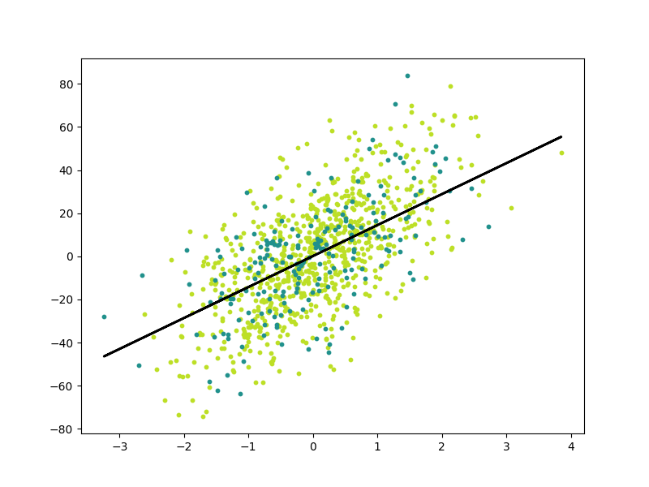

# 1.0 Objectives

We implement Linear Regression from scratch in this repository. We're essentially trying to fit a linear line as best as possible across our many datapoints.



# 2.0 Formulas

Our model can be written by the below equation. Here, $\hat{y}$ is our model's prediction $x$ is our input, $w$ is the weight/slope (e.g., how strongly $x$ influences $\hat{y}$), $b$ is the bias term. (1) is the single example version, while (2) is the whole dataset version.

```math
\begin{align}
\hat{y} &= wx + b \tag{1} \\
y_{\text{pred}} &= wX + b \tag{2}
\end{align}
```

When training, we aim to minimize the MSE (Mean Squared Error) between our predicted values, $\hat{y}$, and actual values $y$. This will be our **cost/loss function**.*

```math
\text{MSE} = J(w,b) = \frac{1}{N} \sum_{i=1}^{N} \left(y_i - (w x_i + b)\right)^2
```

In Linear Regression, we minimize MSE by using [gradient descent](https://www.ibm.com/think/topics/gradient-descent), which is an optimization technique that iteratively finds the best $w$ and $b$. We detail the **vanilla/batch** gradient descent algorithm below:

1. **Initialize Parameters:** Start with an initial guess for the model's parameters (e.g., weights and biases), often chosen randomly or set to zero.

2. **Calculate the Cost Function:** Evaluate the model's performance by computing the value of the cost function, which measures how "wrong" the model's predictions are compared to the actual data.

3. **Compute Gradients:** Calculate the gradient of the cost function with respect to each parameter. The gradient is the partial derivative that indicates the direction of the steepest ascent (uphill) from the current position. In our case, it's detailed by the below equations:

```math
J'(w,b) = \begin{bmatrix}\frac{\partial J}{\partial w} \\ \frac{\partial J}{\partial b}\end{bmatrix} = \begin{bmatrix} 
\frac{1}{N} \sum_{i=1}^{N} -2 x_i \left(y_i - (w x_i + b)\right)
\\ 
\frac{1}{N} \sum_{i=1}^{N} -2 \left(y_i - (w x_i + b)\right)\end{bmatrix} = \begin{bmatrix} 
\frac{1}{N} \sum_{i=1}^{N} 2 x_i \left(\hat{y} - y_i\right)
\\ 
\frac{1}{N} \sum_{i=1}^{N} 2 \left(\hat{y} - y_i\right)\end{bmatrix}
```

4. **Update Parameters:** Adjust the parameters by moving in the opposite direction of the gradient to minimize the cost. This is done using the formula:
    ```math
    \theta _{\text{new}}=\theta _{\text{old}}-\alpha \cdot \nabla J(\theta )
    ```
    where $\theta$ represents the parameters, $\alpha$ is the learning rate (step size), and $\nabla J(\theta )$ is the gradient. A key hyperparameter, the learning rate controls the size of the steps taken.

5. **Repeat Until Convergence:** Steps 2 through 4 are repeated iteratively until a stopping criterion is met. Common stopping criteria include:
    1. The cost function value changes by a negligible amount.  
    2. The magnitude of the gradient is close to zero.  
    3. A maximum number of iterations (epochs) has been reached  

**It’s worth noting that a loss function refers to the error of one training example, while a cost function calculates the average error across an entire training set.*

# Resources
- Complete Step-by-Step Gradient Descent Algorithm from Scratch: https://towardsdatascience.com/complete-step-by-step-gradient-descent-algorithm-from-scratch-acba013e8420
- LaTex formatting with ChatGPT 🤣: https://chatgpt.com/share/69820d01-2458-800e-89b5-33af1b89c350
- How to implement Linear Regression from scratch with Python: https://youtu.be/ltXSoduiVwY?si=d-bKjJua0XVSVtg2
- Regularization in Machine Learning: https://www.geeksforgeeks.org/machine-learning/regularization-in-machine-learning/
